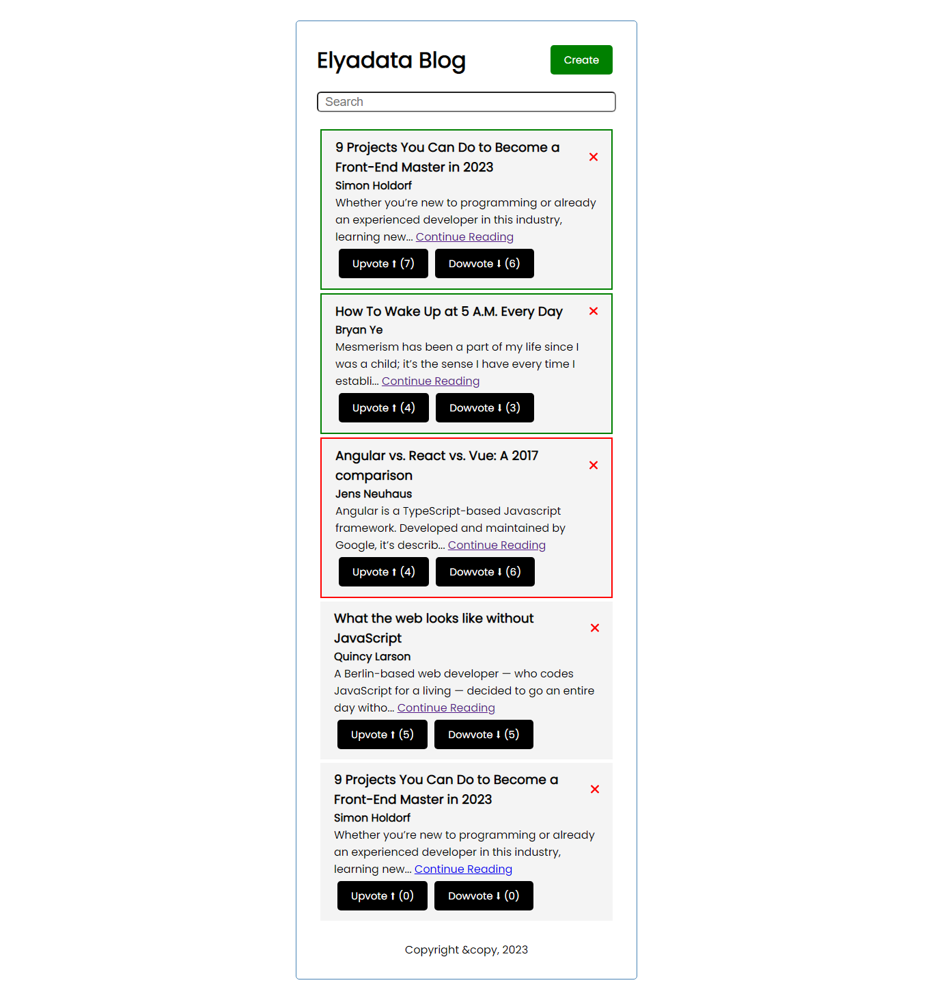
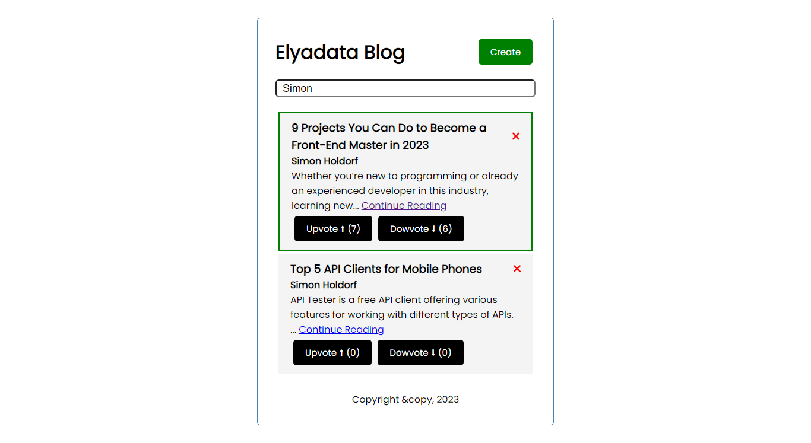
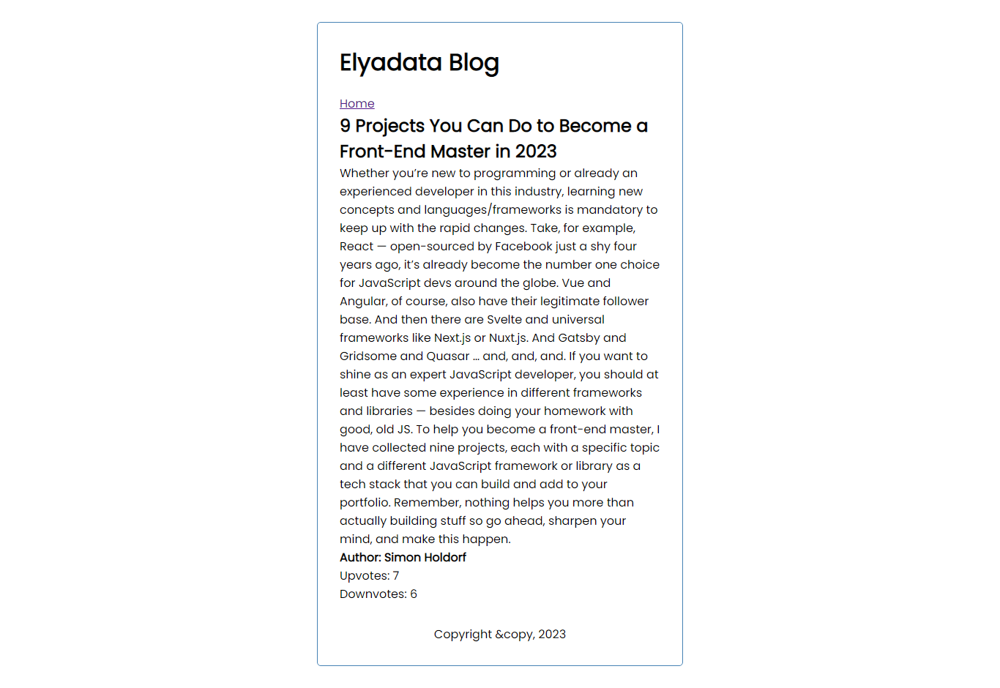
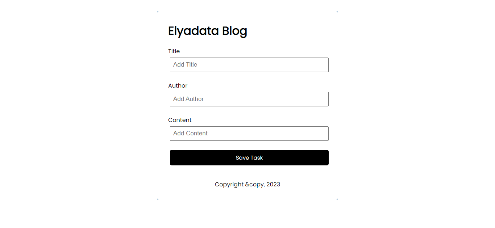

# Blog App

This is a simple blog app built with Angular and json-server.

## Prerequisites

To run this app, you'll need the following:

- Node.js
- Angular CLI
- json-server

## Installation

1. Clone this repository:
   git clone https://github.com/montawork/elyadata-blog.git

2. Navigate to the blog-app directory:
   cd elyadata-blog

3. Install the dependencies:
   npm install

## Running the app

1. Start the json-server:
   npm run server

2. In a separate terminal, start the Angular app:
   ng serve

This will open the app in your default browser at http://localhost:4200/.

3. Use the app to view and add blogs.

## Features

- This app has the following features:
- Displays a list of blogs previews
- Each blog has a title, content, author, an upvote and downvote buttons.
- Each blog has 'continue reading' link that redirects to the detailed blog page.
- For each blog, the style is determined by the upvote/downvote ratio.
- Full text search filter for the blog's content/title/author.
- After submitting the blog, the app redirects to the main blogs list page.

## API endpoints

This app uses a simple json-server to serve the blogs data. The following endpoints are available:

- GET /blogs: fetches all the blogs in the database.
- GET /blogs/:id: fetches a blog by ID from the database.
- POST /blogs: adds a new blog to the database.

;

;

;

;

## Contact

If you have any questions or feedback, feel free to contact me at:
Email: hmonta.work@gmail.com
[LinkedIn](https://www.linkedin.com/in/montassar-haddaji/)
